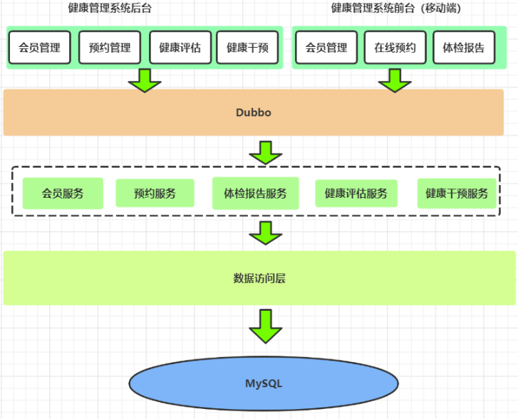

# Health_System

# 1. 项目概述

## 1.1 项目介绍

&emsp;&emsp;随着国家对医疗健康政策的调整，越来越多的新兴医疗机构涌现，大批的创业者和传统医疗公司纷纷加入，健康管理机构的业务不能快速的成型，投入产出不成比例等问题逐渐浮现。而健康管理系统应运而生，能够充分解决这些问题。

## 1.2 技术架构

 技术栈：SpringBoot + Spring Security + dubbo + Redis + Zookeeper + MyBatis + MySQL + Echarts
 &emsp;&emsp;本项目使用分布式RPC服务框架Dubbo。它采用了分层架构，将系统划分为多个模块，每个模块都有明确的职责，便于维护和管理。采用Spring Security来保护应用程序的安全性，进行身份验证、授权、防止受到网络攻击。使用Redis集群缓存方案提高访问速度和系统性能,清理无效缓存。

## 1.3 功能架构

# 2. 环境搭建

## 2.1 项目结构

本项目采用maven分模块开发方式，即对整个项目拆分为几个maven工程，每个maven工程存放特定的一类代码，具体如下：
- **health_parent**：父工程，打包方式为pom，同时聚合其他子模块便于统一执行maven命令
- **health_common**：公共通用模块，打包方式为jar， 存放项目中使用到的一些工具类、实体类、返回结果和常量类
- **health_interface**：打包方式为jar，存放服务接口
- **health_service_provider**：Dubbo服务模块，打包方式为war，存放服务实现类、Dao接口、Mapper映射文件等，作为服务提供方，需要部署到tomcat运行
- **health_backend**：健康管理后台，打包方式为war，作为Dubbo服务消费方，存放Controller、HTML页面、js、css、SpringBoot配置文件等，需要部署到tomcat运行
- **health_mobile**：移动端前台，打包方式为war，作为Dubbo服务消费方，存放Controller、HTML页面、js、css、SpringBoot配置文件等，需要部署到tomcat运行

# 3. 图片存储方案

## 3.1 介绍
在实际开发中，我们会有很多处理不同功能的服务器。例如：

应用服务器：负责部署我们的应用

数据库服务器：运行我们的数据库

文件服务器：负责存储用户上传文件的服务器

分服务器处理的目的是让服务器各司其职，从而提高我们项目的运行效率。

常见的图片存储方案：

方案一：使用nginx搭建图片服务器

方案二：使用开源的分布式文件存储系统，例如FastDFS、HDFS等

方案三：使用云存储，例如阿里云、七牛云等

# 4. 页面静态化

&emsp;&emsp;我们已经实现了移动端套餐列表和套餐详情页面的动态展示。但是对于这两个页面来说，每次用户访问这两个页面都需要查询数据库获取动态数据进行展示，而且这两个页面的访问量是比较大的，这就对数据库造成了很大的访问压力，并且数据库中的数据变化频率并不高。
 &emsp;&emsp;这样我们可以通过**页面静态化技术**为数据库减压并提高系统运行性能。页面静态化其实就是将原来的动态网页(例如通过ajax请求动态获取数据库中的数据并展示的网页)改为通过静态化技术生成的静态网页，这样用户在访问网页时，服务器直接给用户响应静态html页面，不需要再动态查询数据库。
 &emsp;&emsp;我们也不需要手动生成静态化页面，可以通过页面静态化技术中的模板引擎自动帮我们生成所需的静态HTML页面，例如：Freemarker、thymeleaf等。